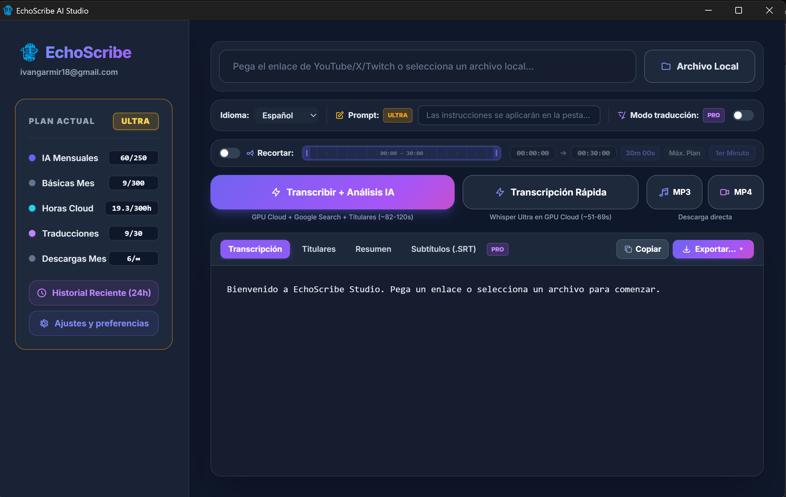
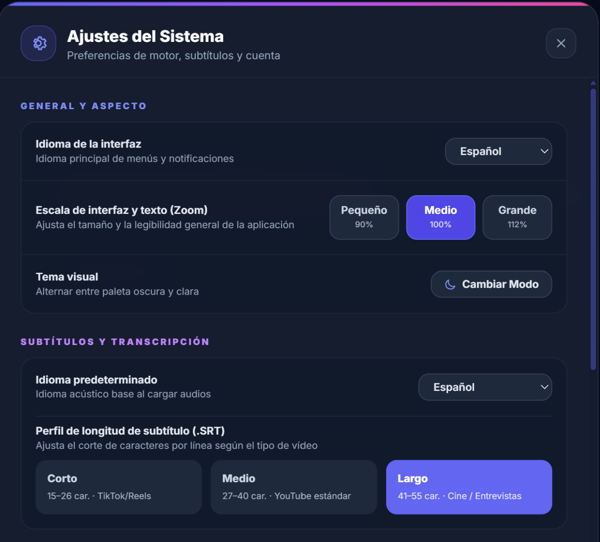
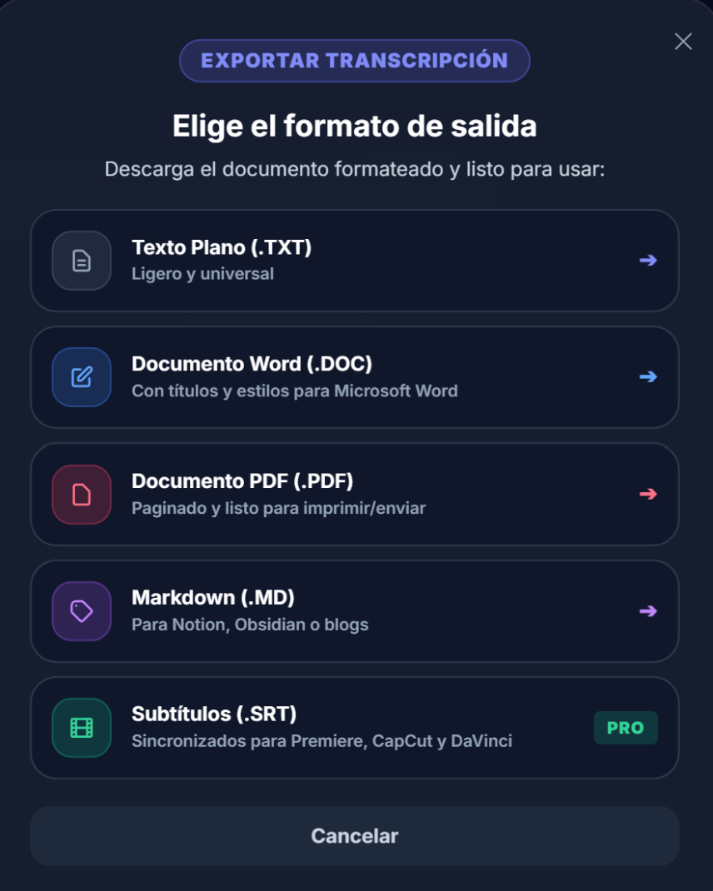

<div align="center">

# EchoScribe AI Studio

### **The All-in-One Speech-to-Text & Content Studio for Windows**
*High-speed Whisper cloud transcription, AI-powered summaries & headlines, direct media downloader (MP3/MP4), and smart subtitle formatting for CapCut, Premiere & DaVinci.*

[](https://www.echoscribe.es)
[](https://github.com/ivangarmir18/EchoScribe/releases)
[](https://www.virustotal.com/gui/file/ec0517c1cc365f2dfb43d8715e7aaaa3b8cf6583c63ef8b121f6107fc163f55d/detection)
[](https://github.com/ivangarmir18/EchoScribe/releases)
[](LICENSE)

<br/>

**[English](README.md)** • **[Español](README_ES.md)** • **[Technical Architecture](docs/ARCHITECTURE.md)** • **[Benchmarks](docs/BENCHMARKS.md)** • **[Download Installer](https://github.com/ivangarmir18/EchoScribe/releases)**

<br/>

> **"Transform any audio, video or streaming URL into accurate transcripts, AI summaries, and video-editor-ready subtitles in seconds."**

</div>

---

## Visual Showcase

<div align="center">

### Main Application Dashboard

*Modern desktop interface with stream ingestion, translation toggle, quick AI analysis, and instant media downloads.*

<br/>

| Interactive Audio Trimmer | Subtitle & Profile Configuration | Multi-Format Export Center |
| :---: | :---: | :---: |
|  |  |  |
| *Visual range trimmer (0-30m, 1st Minute shortcut)* | *Ergonomic subtitle profiles (TikTok, YouTube, Cinema)* | *1-Click export to TXT, Word, PDF, Markdown & SRT* |

</div>

---

## What is EchoScribe?

**EchoScribe AI Studio** is a productivity-focused Windows desktop application built for content creators, video editors, journalists, students, and professionals who need fast, accurate speech-to-text without dealing with Python scripts, CUDA drivers, or bloated web apps.

### What Makes EchoScribe Different?

1. **Universal Ingestion & Media Extractor**:
   - Paste links directly from **YouTube, X (Twitter), Twitch**, or drop local files (**MP3, MP4, WAV, MKV, M4A, FLAC**).
   - Direct download buttons to save pure **MP3 audio** or **MP4 video** in one click.

2. **Interactive Audio Trimmer**:
   - Visual slider to transcribe only the exact fragment you need (e.g. first 60 seconds, custom timecodes), saving cloud time and tokens.

3. **Two Tailored Processing Modes**:
   - **⚡ Quick Transcription (~50–70s)**: High-speed Whisper Ultra on cloud GPU for immediate verbatim text.
   - **⚡ Transcribe + AI Analysis (~80–120s)**: Full acoustic transcription combined with Google Search grounding to automatically generate **Headlines (Titulares)** and **Executive Summaries (Resumen)**.

4. **Smart Subtitle Generation (CapCut, Premiere & DaVinci Ready)**:
   - Configurable subtitle density presets:
     - **Short (15–26 chars)**: Optimized for TikTok, Instagram Reels, and YouTube Shorts.
     - **Medium (27–40 chars)**: Standard cadence for YouTube and web video essays.
     - **Long (41–55 chars)**: Cinema, interviews, and documentary broadcast standards.
   - Eliminates awkward orphan words and broken phrases.

5. **Multi-Format 1-Click Export**:
   - **Plain Text (.TXT)**: Lightweight and universal.
   - **Microsoft Word (.DOC)**: Formatted with headings and styles ready to edit.
   - **Printable PDF (.PDF)**: Paginated and cleanly formatted.
   - **Markdown (.MD)**: Ideal for Notion, Obsidian, and personal knowledge bases.
   - **Subtitles (.SRT)**: Synchronized timecodes ready to drop directly into your video timeline.

6. **Native Windows Experience**:
   - Built with Microsoft Edge WebView2 (Chromium).
   - Fast startup (< 1.2s), low RAM consumption (< 180MB), native dark/light mode, and interface zoom controls (90%, 100%, 112%).

---

## Repository Structure: Open-Source Core + Desktop Release

This repository serves two purposes:
1. **Open-Source Algorithmic Core (`quickstart_demo.py`)**: Contains the standalone Python implementation of EchoScribe's Whisper hallucination loop-breaker and the elastic subtitle splitting algorithm. Anyone can test, inspect, and integrate these algorithms freely.
2. **Desktop Release Distribution**: Official hub for the compiled Windows installer (`EchoScribe_Setup.exe`), release notes, VirusTotal security audit reports, and technical architecture documentation.

---

## Quickstart: Testing the Core Algorithms Locally

You can test the core anti-hallucination filter and the subtitle cue generator in under a minute without needing any API keys or GPU:

```bash
# 1. Clone the repository
git clone https://github.com/ivangarmir18/EchoScribe.git
cd EchoScribe

# 2. Run the algorithmic demo
python quickstart_demo.py

# 3. Run the unit test suite
python -m pytest test_quickstart.py
```

---

## Downloading the Windows Application

To install the complete **EchoScribe AI Studio** desktop application:

1. Download **`EchoScribe_Setup.exe` (v1.3.3)** from [**echoscribe.es**](https://www.echoscribe.es) or from [**GitHub Releases**](https://github.com/ivangarmir18/EchoScribe/releases).
2. Check the verified [**VirusTotal Clean Scan Report**](https://www.virustotal.com/gui/file/ec0517c1cc365f2dfb43d8715e7aaaa3b8cf6583c63ef8b121f6107fc163f55d/detection).
3. Run the installer and launch EchoScribe from your desktop shortcut.

---

## Technical Documentation

- [**docs/ARCHITECTURE.md**](docs/ARCHITECTURE.md): System topology, ingestion pipeline, and cloud GPU architecture.
- [**docs/BENCHMARKS.md**](docs/BENCHMARKS.md): Performance benchmarks, latency comparisons, and error rate analysis.

---

## License

Distributed under the MIT License. See [LICENSE](LICENSE) for more details.

Created by [Iván García Miranda](https://www.echoscribe.es/sobre-mi).
